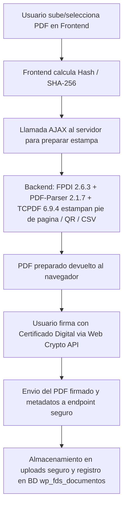

# Arquitectura: Módulo de Firma PDF (`ep-signature`)

**Ubicación:** `plugins/ep-signature/`  
**Objetivo:** Permitir a los empleados y administradores firmar documentos PDF digitalmente asegurando la privacidad de la clave privada y generando evidencias de verificación (CSV / QR).

---

## 1. Principio Fundamental de Seguridad
* **Firma en el lado del cliente (Client-side Signing):**  
  La clave privada del certificado del usuario **nunca** sale de su navegador. Se utiliza la **Web Cryptography API** del navegador web para calcular y aplicar la firma criptográfica sobre el hash del documento.
* **Procesamiento de evidencias en servidor:**  
  El servidor únicamente recibe el documento o el hash para estampar la representación visual (código QR, Código de Verificación Seguro - CVS, metadatos del firmante y fecha).

---

## 2. Pipeline de Procesamiento de PDFs

Antes de entregar el PDF al parser se aplica un **tope de tamaño de 25 MB**, filtrable
con `ep_signature_max_pdf_bytes`, para devolver un error legible en lugar de un fatal por
falta de memoria.

## 3. Componentes y Librerías Clave
> [!warning] Versiones corregidas el 2026-09-04
> Esta nota decía "FPDI v2.1.7". **Era un error de nomenclatura**: 2.1.7 es la versión
> del *add-on* PDF-Parser, no la de FPDI. Son librerías distintas, con numeración propia.
> Verificado leyendo el código, no la documentación.

* **FPDI — `libs/fpdi/`, v2.6.3** (`src/Fpdi.php`, `const VERSION = '2.6.3'`): parser e
  importador de páginas PDF existentes. Permite tomar un PDF subido por el usuario y
  reutilizar sus páginas como plantillas sin corromper fuentes ni metadatos. El plugin
  carga su autoloader desde `libs/fpdi/src/autoload.php`.
* **FPDI PDF-Parser — `libs/pdf-mod/`, v2.1.7** (`setasign/fpdi_pdf-parser`, add-on
  **comercial** de setasign, licencia propietaria): es lo que permite leer PDF con
  *xref comprimido* (PDF 1.5+). Sin él, esos documentos no se pueden preparar. Se carga
  desde `libs/pdf-mod/src/autoload.php` y su ausencia sólo genera un aviso en el log.
  * Su `composer.json` declara `setasign/fpdi: ^2.6.6`, es decir **pide una FPDI más
    nueva de la que tenemos**. En la práctica funciona: la comprobación en tiempo de
    ejecución sólo exige `PdfString::escape`, y se verificó que la 2.6.3 ofrece todo lo
    que el parser 2.1.7 usa (`PdfArray::ensure` con tamaño,
    `CrossReferenceException::INVALID_DATA`, `PdfParserException::INVALID_DATA_SIZE`,
    `StreamReader::getTotalLength`). **Subir FPDI queda pendiente aparte**, porque
    `EP_Fpdi_V4` depende de las interioridades de la versión actual.
  * La 2.1.7 endureció la validación de los parámetros que vienen dentro del propio PDF
    (`Predictor`, `CompressedReader`, `SecHandler`, `SaslPrep`). Ver el commit `9907a4e`.
* **TCPDF — `libs/tcpdf/`, v6.9.4**: motor de dibujo y generación de elementos gráficos,
  textos de validación, cajas de firma y marcas visuales sobre las páginas importadas.
* **PHPQRCode (`libs/phpqrcode/`):** generación in-memory de códigos QR con la URL de
  verificación pública del documento.
* **Base de datos (`wp_fds_documentos`):** tabla personalizada que almacena identificador
  único, CSV generado, hash SHA-256 original y final, estado de la firma, ID del
  firmante, timestamp y ruta al archivo en disco.

##### Despliegue de estas librerías
`deploy.ps1` y `deploy-staging.ps1` **excluyen `plugins/ep-signature/libs/*`**: las
librerías no viajan en el despliegue normal. Para subirlas hay que usar
`deploy-fpdi-parser.ps1`. Es un pie del que es fácil olvidarse al actualizar cualquiera
de las tres.

## 4. Shortcodes y Vistas Frontend
> [!warning] Sección desfasada (comprobado el 2026-09-04)
> **Ninguno de los shortcodes `fds_*` existe ya**: en todo el repositorio sólo hay cuatro
> `add_shortcode` (`ep_login_button`, `employee_portal`, `portal_censo_manager`,
> `ep_inventory_dashboard`). El módulo se renderiza hoy por vistas, no por shortcodes.

Lo que hay realmente:

* **`views/signature-view.php`** — vista completa (`render_full_view()`), con pestañas
  "Firmar Documento" y "Mis Documentos" (`#fds-my-docs-table`, alimentada por el
  sub-action AJAX `get_my_docs`).
* **`views/verification-view.php`** — verificación pública por CSV
  (`render_verification_view($csv)`), que es la página a la que apunta el QR.
* **`render_dashboard_card()`** — tarjeta del módulo en el escritorio del portal.
* Todo el frontend habla con un único `handle_ajax()` que despacha por `sub_action`
  (`prepare_pdf`, `save_signed_pdf`, `get_my_docs`, `request_signature`, `get_inbox`…),
  protegido por el nonce `ep_signature_nonce`.
* **Código muerto pendiente de retirar:** `public/partials/signature-app.php` sigue
  llamando a `[firma_documentos]` y `[fds_mis_documentos]`, que ya no existen.
