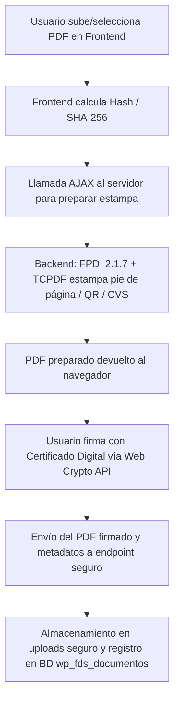

# Arquitectura: Módulo de Firma PDF (`ep-signature`)

**Ubicación:** `plugins/ep-signature/`  
**Objetivo:** Permitir a los empleados y administradores firmar documentos PDF digitalmente asegurando la privacidad de la clave privada y generando evidencias de verificación (CSV / QR).

---

## 1. Principio Fundamental de Seguridad
* **Firma en el lado del cliente (Client-side Signing):**  
  La clave privada del certificado del usuario **nunca** sale de su navegador. Se utiliza la **Web Cryptography API** del navegador web para calcular y aplicar la firma criptográfica sobre el hash del documento.
* **Procesamiento de evidencias en servidor:**  
  El servidor únicamente recibe el documento o el hash para estampar la representación visual (código QR, Código de Verificación Seguro - CVS, metadatos del firmante y fecha).

---

## 2. Pipeline de Procesamiento de PDFs

---

## 3. Componentes y Librerías Clave
* **FPDI (`libs/fpdi/` v2.1.7):** Parser e importador de páginas PDF existentes. Permite tomar un PDF subido por el usuario y reutilizar sus páginas como plantillas sin corromper fuentes ni metadatos.
* **TCPDF (`libs/tcpdf/`):** Motor de dibujo y generación de elementos gráficos, textos de validación, cajas de firma y marcas visuales sobre las páginas importadas por FPDI.
* **PHPQRCode (`libs/phpqrcode/`):** Generación in-memory de códigos QR con la URL de verificación pública del documento.
* **Base de datos (`wp_fds_documentos`):** Tabla personalizada que almacena: identificador único, CVS generado, hash SHA-256 original y final, estado de la firma, ID del firmante, timestamp y ruta al archivo en disco.

---

## 4. Shortcodes y Vistas Frontend
* `[fds_firmar_documento]`: Formulario de subida y panel de firma interactiva en el navegador.
* `[fds_mis_documentos]`: Tabla interactiva donde el empleado puede listar, previsualizar y descargar sus documentos firmados o pendientes de firma.
* `[fds_verificar_documento]`: Página pública o privada para verificar la autenticidad de un documento introduciendo su CSV o escaneando el código QR.
